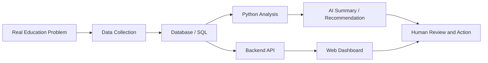

# AI 教育管理项目计划草案

## 1. 项目定位

这个项目的目标不是让学生重新搭建 CSAA 管理系统，也不是直接参与主系统源码开发。

更合适的定位是：

> 以一个真实教育管理系统作为数据源，让高中生理解 AI 项目的完整流程：数据收集、数据库设计、Web 系统、API 连接、Python 数据分析、AI 总结、推荐系统和负责任 AI。

CSAA 管理系统在这里扮演的是“真实业务场景”和“数据来源”的角色。

学生项目可以使用脱敏后的模拟数据，围绕真实问题做一个轻量 AI 原型，而不需要接触正式系统的完整源码或真实隐私数据。

## 2. 为什么这个项目适合高中生

这个项目的好处是它不是一个空泛的 AI demo，而是来自真实教育管理问题。

学生可以看到：

- 数据为什么重要
- 数据库为什么要设计清楚
- Web 系统如何收集和展示数据
- API 如何连接前端、后端和 AI
- Python 如何做分析
- AI 如何总结老师评论
- 推荐系统如何辅助管理员做决策
- 为什么 AI 不能随便使用学生隐私数据

项目难度可以拆分，每个学生负责一个清晰模块，最后组合成一个完整演示。

## 3. 项目核心问题

可以从下面两个大方向中选择一个，也可以把两个方向合并成一个完整项目。

### 方向 A：AI Student Learning Profile

目标是为每个学生生成一个学习画像。

系统根据学生的课程记录、出勤记录、补课记录、老师评论和课程进度，生成一个可读的学生 profile。

可能包含：

- 学生基本信息
- 当前课程和 level
- 出勤情况
- 缺课和补课情况
- 老师评论摘要
- 已掌握内容
- 需要复习内容
- 下一步学习建议
- 给家长看的友好总结

这个方向更适合展示 AI 如何处理老师 comments 这类非结构化文本。

### 方向 B：Student Support Prediction

目标是识别哪些学生可能需要额外支持。

系统根据出勤、补课、课程进度和老师反馈，分析学生是否可能出现学习断点。

可能输出：

- 哪些学生缺课较多
- 哪些学生补课没有完成
- 哪些学生老师评论中反复出现 similar weakness
- 哪些学生可能需要 review lesson
- 哪些学生适合安排 makeup lesson
- 哪些课程或 level 缺课率更高

这个方向更适合展示数据分析、简单预测和推荐系统。

## 4. 建议项目主题

建议先用一个合并后的主题，既完整又容易讲清楚：

> AI Student Support Assistant for Education Management

中文可以叫：

> 教育管理场景下的 AI 学生支持助手

这个主题不只是记录发生了什么，而是尝试回答：

- 学生最近学习状态如何？
- 是否有缺课或补课风险？
- 老师评论中反复出现了什么学习问题？
- 学生下一步需要什么支持？
- 管理员或老师可以采取什么行动？

## 5. 技术流程

项目可以按照下面的完整 AI 项目流程讲解：



核心概念：

- SQL 负责保存和查询数据
- Python 负责清洗数据、分析数据、做图表、跑简单模型
- Web 前端负责让老师、家长、管理员看到结果
- API 负责让前端、数据库和 AI 服务互相连接
- AI 负责从数据中总结、预测、推荐

一句话总结：

> AI 是利用数据、Python、SQL、Web、API 等技术，把普通系统升级成可以分析、判断和建议的系统。

再补一句：

> 没有数据和系统，AI 就没有上下文；没有业务问题，AI 就不知道该解决什么。

## 6. 四人小组分工

每组建议 4 名学生，每个人负责一个模块。

### 学生 1：Data & SQL

负责数据结构和查询。

任务：

- 理解模拟数据
- 设计或阅读表结构
- 整理 student、course、attendance、makeup、comment 等数据表
- 写 SQL 查询
- 找出某个学生的请假、补课、课程进度记录

示例 SQL：

```sql
SELECT student_id, COUNT(*) AS absent_count
FROM attendance
WHERE attendance_status = 'absent'
GROUP BY student_id;
```

可以展示的问题：

- Which students missed the most classes?
- Which students still need makeup lessons?
- Which courses have higher absence rates?

核心学习点：

> AI 的第一步是数据结构化。

### 学生 2：Python Analysis

负责数据分析。

任务：

- 用 Python 读取 CSV
- 清洗数据
- 计算缺课率
- 计算补课完成率
- 分析请假和课程进度是否有关
- 做简单图表

可以做的问题：

- Which students missed the most classes?
- Which level has the highest absence rate?
- Do students with more absences have slower progress?
- Which students may need extra review?

可以使用的工具：

- Python
- pandas
- matplotlib 或 plotly
- Jupyter Notebook

核心学习点：

> AI 之前，先要会用数据发现问题。

### 学生 3：AI Comment Summary

负责最像 AI 的部分。

任务：

- 读取老师 comments
- 用 AI 总结学生表现
- 提取 learning tags
- 判断 mastered / needs review / next step
- 生成 parent-friendly summary

老师原始 comment 示例：

```text
Student understands loops but still needs help with debugging.
```

AI 输出示例：

```json
{
  "mastered": ["loops"],
  "needs_review": ["debugging"],
  "next_step": "Practice debugging before the next project",
  "parent_summary": "The student is making progress but needs more practice with debugging."
}
```

核心学习点：

> AI 特别适合处理非结构化文本。

### 学生 4：Web Dashboard & Presentation

负责展示和汇报。

任务：

- 设计一个简单 Web dashboard
- 显示学生 profile
- 显示 attendance summary
- 显示 makeup status
- 显示 AI summary
- 显示补课或学习支持建议
- 整理 final presentation

页面可以包括：

- Student Name / ID
- Current Level
- Attendance Summary
- Makeup Status
- Teacher Comment Summary
- AI Learning Support Suggestion

核心学习点：

> AI 项目最终要变成别人能使用的产品。

## 7. 推荐的数据表

为了保护主系统和真实隐私，学生项目建议使用单独的脱敏 CSV 或轻量 SQLite 数据库。

建议准备以下表：

### students

- student_id
- student_name
- age_group
- level
- parent_id

### courses

- course_id
- course_name
- category
- level

### enrollments

- enrollment_id
- student_id
- course_id
- term_id
- regular_day
- regular_time
- room

### attendance

- attendance_id
- student_id
- course_id
- lesson_date
- attendance_status
- is_makeup

### makeup_lessons

- makeup_id
- student_id
- original_lesson_date
- makeup_lesson_date
- makeup_status

### teacher_comments

- comment_id
- student_id
- course_id
- lesson_date
- teacher_comment

### progress

- progress_id
- student_id
- course_id
- lesson_date
- topic
- progress_status

## 8. 最终展示成果

每组最终可以展示一个轻量原型，而不是完整商业系统。

建议成果包括：

- 一份脱敏模拟数据集
- 一个 SQL 查询示例
- 一个 Python 分析 notebook
- 一张或多张数据图表
- 一个 AI comment summary 示例
- 一个简单 Web dashboard
- 一个 final presentation
- 一段关于 responsible AI 的说明

## 9. Responsible AI 要求

这个项目必须加入负责任 AI 的讨论。

学生需要理解：

- 不能直接使用真实学生隐私数据
- 需要使用脱敏数据或模拟数据
- AI 输出只是建议，不是最终决定
- 老师或管理员需要人工审核
- AI 可能会误判
- 不能用 AI 给学生贴负面标签
- 家长可见内容必须友好、准确、谨慎

建议在项目中明确写出：

> The AI assistant provides learning support suggestions, but final decisions should always be reviewed by teachers or administrators.

## 10. 不建议开放的部分

为了控制风险，不建议高中生直接接触以下内容：

- 正式系统完整源码
- 真实学生隐私数据
- 真实家长联系方式
- 真实付款信息
- 服务器部署权限
- 管理员账号

可以开放给学生的是：

- 脱敏 CSV
- 简化版数据库
- 简化 API 示例
- 独立 demo dashboard
- 模拟老师 comments

## 11. 学校需要确认的问题

下午讨论时建议确认：

1. 学校希望项目偏技术展示，还是偏教育应用展示？
2. 学生是否已经学过 Python？
3. 学生是否学过 SQL？
4. 是否允许学生使用 ChatGPT 或 OpenAI API？
5. 是否需要完全离线完成？
6. 是否需要参加 AI 创客赛或校内展示？
7. 项目周期是几周？
8. 最终成果是 presentation、demo app，还是 research poster？
9. 是否可以提供脱敏数据？
10. 是否需要家长或学校层面的数据使用说明？

## 12. 建议项目周期

如果时间较短，可以按 3 到 4 周安排。

### Week 1：理解问题和数据

- 介绍 CSAA 业务场景
- 讲解学生、课程、出勤、评论数据
- 分配小组角色
- 准备 CSV 数据

### Week 2：SQL 和 Python 分析

- 学生 1 完成基础 SQL 查询
- 学生 2 完成 Python 数据分析和图表
- 小组讨论从数据中发现的问题

### Week 3：AI 总结和 Dashboard

- 学生 3 完成 comment summary
- 学生 4 完成 dashboard 原型
- 小组整合结果

### Week 4：优化和汇报

- 加入 responsible AI
- 优化展示页面
- 准备 final presentation
- 进行 demo rehearsal

## 13. 一句话汇报版本

这个学生项目不是让高中生重新开发 CSAA 系统，而是让他们基于一个真实教育管理系统的数据场景，学习 AI 项目的完整链路：从数据结构化、SQL 查询、Python 分析，到 AI 文本总结、学习支持建议和可视化 dashboard，最终理解 AI 如何在真实教育场景中负责任地辅助老师和管理员。

