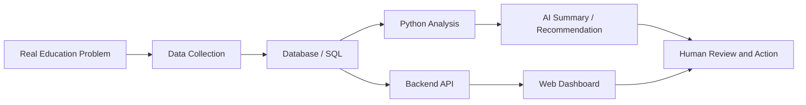
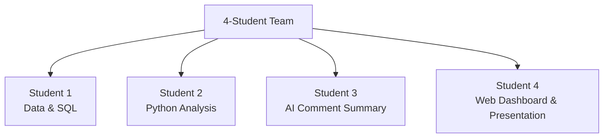

# AI Student Project Plan

## 1. Project Purpose

This project is not about rebuilding the CSAA management system.

The real goal is to use a real education management system as a data source, so students can understand the full workflow of an AI project:

- Data collection
- Database design
- Web system design
- API connection
- Python data analysis
- AI text summary
- Recommendation systems
- Responsible AI

The CSAA management system provides the real-world context.

Students will work with anonymized or simulated data. They do not need access to the full production source code, real student privacy data, payment data, or administrator accounts.

The student project should be a small AI prototype based on a real education problem.

## 2. Why This Project Matters

Many AI projects fail because they start with a tool instead of a real problem.

This project starts from a real school operation problem:

- Students attend classes.
- Some students are absent.
- Some students need makeup lessons.
- Teachers write comments.
- Administrators need to understand who may need support.
- Parents need clear and friendly communication.

This makes the project meaningful because students can see how data, software, and AI connect in a real organization.

Students will learn that AI is not just a chatbot. AI becomes useful when it is connected to structured data, business logic, and human decision-making.

## 3. Recommended Project Theme

The recommended project theme is:

> AI Student Support Assistant for Education Management

The goal is to build a small prototype that can help teachers or administrators understand student learning status and support needs.

The system should try to answer questions such as:

- How is this student doing recently?
- Did the student miss many classes?
- Did the student complete makeup lessons?
- What do teacher comments say about the student's learning?
- What topics has the student mastered?
- What topics need review?
- Does this student need extra support?
- What action should the teacher or administrator consider next?

## 4. Two Possible AI Directions

### Direction A: AI Student Learning Profile

This direction focuses on building a learning profile for each student.

The profile may include:

- Student basic information
- Current course and level
- Attendance summary
- Absence and makeup records
- Teacher comment summary
- Skills already mastered
- Skills that need review
- Suggested next step
- Parent-friendly summary

This direction is useful because teacher comments are unstructured text. AI is especially good at summarizing and extracting meaning from text.

### Direction B: Student Support Prediction

This direction focuses on identifying students who may need additional support.

The system may analyze:

- Absence frequency
- Makeup lesson completion
- Course progress
- Teacher feedback
- Repeated learning difficulties

Possible outputs:

- Students with high absence rates
- Students who still need makeup lessons
- Students whose comments show repeated difficulties
- Students who may need review lessons
- Recommended support actions

This direction is useful because it combines data analysis, simple prediction, and recommendation logic.

## 5. Full AI Project Workflow



In this workflow:

- SQL stores and queries the data.
- Python cleans the data, analyzes it, and creates charts.
- The web dashboard displays results to users.
- APIs connect the frontend, backend, database, and AI tools.
- AI summarizes, predicts, and recommends.
- Humans review and make the final decision.

Key idea:

> AI uses data, Python, SQL, web systems, and APIs to upgrade a normal system into a system that can analyze, summarize, predict, and recommend.

Another key idea:

> Without data and systems, AI has no context. Without a real problem, AI does not know what to solve.

## 6. Practical Technology Stack

This project does not require students to become professional software engineers immediately.

The goal is to let students understand how different technologies work together in a practical AI project.

Each technology should be taught through a small useful task.

### 6.1 Data Files: CSV / Excel

Purpose:

CSV or Excel files are the easiest way to start collecting and sharing data.

In this project, CSV files can store:

- Student information
- Course information
- Attendance records
- Makeup lesson records
- Teacher comments
- Progress records

Student practice:

- Open a CSV file
- Understand rows and columns
- Clean incorrect values
- Check missing data
- Export a cleaned version

Practical output:

- A clean sample dataset that the whole team can use

### 6.2 Database: SQLite

Purpose:

A database stores structured data more reliably than a spreadsheet.

SQLite is a good beginner database because it is lightweight and does not require a separate server.

In this project, SQLite can store:

- Students
- Courses
- Enrollments
- Attendance
- Teacher comments
- Makeup lessons

Student practice:

- Understand tables
- Understand primary keys
- Understand relationships between tables
- Import CSV data into SQLite
- Query data using SQL

Practical output:

- A small education-management database

### 6.3 SQL

Purpose:

SQL is used to ask questions from structured data.

For example:

- Which students missed the most classes?
- Which students still need makeup lessons?
- Which course has the highest absence rate?
- What is one student's attendance history?

Student practice:

- SELECT data
- FILTER data with WHERE
- GROUP records
- COUNT absences
- JOIN student and course tables

Practical output:

- A set of useful SQL queries for student support analysis

### 6.4 Python

Purpose:

Python is used for data cleaning, analysis, and simple automation.

In this project, Python can:

- Read CSV files
- Clean data
- Calculate absence rates
- Calculate makeup completion rates
- Create charts
- Prepare data for AI summary

Student practice:

- Use pandas to read data
- Calculate summary statistics
- Create a chart
- Export analysis results

Practical output:

- A Python notebook that shows student attendance and progress analysis

### 6.5 Data Visualization

Purpose:

Charts help people understand data quickly.

In this project, charts can show:

- Absence rate by student
- Absence rate by course level
- Makeup completion status
- Attendance trend over time

Student practice:

- Create bar charts
- Create line charts
- Add labels and titles
- Explain what the chart means

Practical output:

- 2 to 4 simple charts for the final presentation

### 6.6 Web Dashboard

Purpose:

A dashboard turns data analysis into something people can use.

The dashboard does not need to be complex. It can be a simple page that displays a student profile and AI summary.

Possible tools:

- Simple HTML / CSS / JavaScript
- Streamlit
- Flask
- A lightweight React or Vue page if students are more advanced

Recommended beginner option:

> Streamlit is a good choice because students can build a useful dashboard with Python only.

Student practice:

- Build a simple page
- Show student information
- Show attendance summary
- Show charts
- Show AI-generated summary

Practical output:

- A working student support dashboard

### 6.7 API

Purpose:

An API connects different parts of a system.

For example:

- The web dashboard asks the backend for student data.
- The backend reads from the database.
- The AI service receives teacher comments.
- The AI service returns a summary.

Students do not need to build a complex API at first.

Student practice:

- Understand request and response
- Understand JSON
- Call a simple API
- Read returned data

Practical output:

- A simple example showing how data moves between a dashboard and an AI tool

### 6.8 AI / LLM

Purpose:

AI can process unstructured text, such as teacher comments.

In this project, AI can:

- Summarize teacher comments
- Extract mastered skills
- Extract topics that need review
- Generate parent-friendly summaries
- Suggest next learning steps

Student practice:

- Write a clear prompt
- Give AI structured input
- Ask AI to return JSON
- Check if the AI result is reasonable
- Improve the prompt

Practical output:

- An AI comment-summary tool

### 6.9 Recommendation Logic

Purpose:

Recommendation logic helps the system suggest an action.

This does not need to be a complicated machine-learning model.

For a beginner project, simple rule-based logic is enough.

Example rules:

- If a student missed more than 3 classes, mark as "Needs attendance review."
- If a student missed a class and has no makeup lesson, recommend "Schedule makeup lesson."
- If comments mention the same difficulty more than twice, recommend "Review this topic."
- If absence rate is high and progress is slow, recommend "Teacher follow-up."

Student practice:

- Design simple rules
- Explain why the rule makes sense
- Test the rule on sample data
- Avoid overclaiming

Practical output:

- A simple student support recommendation engine

### 6.10 Responsible AI

Purpose:

Responsible AI ensures the system is safe, fair, and respectful.

In this project, students should learn:

- Do not use real private student data
- Use anonymized or simulated data
- AI can make mistakes
- AI suggestions need human review
- Do not label students negatively
- Parent-facing summaries must be careful and friendly

Student practice:

- Write a responsible AI statement
- Identify possible risks
- Explain how humans review AI output

Practical output:

- A responsible AI section in the final presentation

### 6.11 Suggested Beginner Tool Set

For a practical student project, the recommended tool set is:

- CSV / Excel for sample data
- SQLite for database practice
- SQL for querying data
- Python with pandas for analysis
- matplotlib or plotly for charts
- Streamlit for dashboard
- AI/LLM for comment summary
- JSON for structured AI output

This stack is realistic, useful, and not too heavy for high school students.

It can also become a reusable technical training path for future students.

## 7. Team Structure

Each group should have 4 students.

Each student has a clear role, but the final project should be integrated as one team product.



## 8. Student 1: Data & SQL

Student 1 is responsible for data structure and SQL queries.

Main tasks:

- Understand the simulated dataset
- Understand or design table structures
- Work with student, course, attendance, makeup, progress, and comment tables
- Write SQL queries
- Find a student's absence, makeup, and course progress records

Example SQL:

```sql
SELECT student_id, COUNT(*) AS absent_count
FROM attendance
WHERE attendance_status = 'absent'
GROUP BY student_id;
```

Questions this student may answer:

- Which students missed the most classes?
- Which students still need makeup lessons?
- Which courses have higher absence rates?

Core learning point:

> The first step of AI is structured data.

## 9. Student 2: Python Analysis

Student 2 is responsible for data analysis.

Main tasks:

- Read CSV files with Python
- Clean the data
- Calculate absence rates
- Calculate makeup completion rates
- Analyze whether absence may affect progress
- Create simple charts

Possible questions:

- Which students missed the most classes?
- Which level has the highest absence rate?
- Do students with more absences have slower progress?
- Which students may need extra review?

Suggested tools:

- Python
- pandas
- matplotlib or plotly
- Jupyter Notebook

Core learning point:

> Before using AI, we need to use data to discover problems.

## 10. Student 3: AI Comment Summary

Student 3 is responsible for the most AI-focused part.

Main tasks:

- Read teacher comments
- Use AI to summarize student performance
- Extract learning tags
- Identify mastered skills
- Identify topics that need review
- Generate next-step suggestions
- Generate parent-friendly summaries

Example teacher comment:

```text
Student understands loops but still needs help with debugging.
```

Example AI output:

```json
{
  "mastered": ["loops"],
  "needs_review": ["debugging"],
  "next_step": "Practice debugging before the next project",
  "parent_summary": "The student is making progress but needs more practice with debugging."
}
```

Core learning point:

> AI is especially useful for working with unstructured text.

## 11. Student 4: Web Dashboard & Presentation

Student 4 is responsible for presentation and user experience.

Main tasks:

- Design a simple web dashboard
- Display student profile information
- Display attendance summary
- Display makeup status
- Display AI summary
- Display learning support suggestions
- Prepare the final presentation

The dashboard may include:

- Student Name / ID
- Current Level
- Attendance Summary
- Makeup Status
- Teacher Comment Summary
- AI Learning Support Suggestion

Core learning point:

> An AI project becomes useful only when people can understand and use the result.

## 12. Suggested Data Tables

Students should use anonymized CSV files or a simple SQLite database.

### students

- student_id
- student_name
- age_group
- level
- parent_id

### courses

- course_id
- course_name
- category
- level

### enrollments

- enrollment_id
- student_id
- course_id
- term_id
- regular_day
- regular_time
- room

### attendance

- attendance_id
- student_id
- course_id
- lesson_date
- attendance_status
- is_makeup

### makeup_lessons

- makeup_id
- student_id
- original_lesson_date
- makeup_lesson_date
- makeup_status

### teacher_comments

- comment_id
- student_id
- course_id
- lesson_date
- teacher_comment

### progress

- progress_id
- student_id
- course_id
- lesson_date
- topic
- progress_status

## 13. Final Deliverables

Each group should prepare a small prototype, not a full commercial system.

Recommended final deliverables:

- An anonymized sample dataset
- A SQL query example
- A Python analysis notebook
- One or more charts
- An AI teacher-comment summary example
- A simple web dashboard
- A final presentation
- A short responsible AI statement

## 14. Responsible AI Requirements

Responsible AI is an important part of this project.

Students should understand:

- Do not use real student privacy data.
- Use anonymized or simulated data.
- AI output is a suggestion, not a final decision.
- Teachers or administrators must review important decisions.
- AI can make mistakes.
- Do not use AI to label students negatively.
- Parent-facing summaries must be friendly, accurate, and careful.

Recommended statement:

> The AI assistant provides learning support suggestions, but final decisions should always be reviewed by teachers or administrators.

## 15. What Students Should Not Access

Students should not access:

- The full production source code
- Real student private data
- Real parent contact information
- Real payment information
- Server deployment permissions
- Administrator accounts

Students can access:

- Anonymized CSV files
- A simplified database
- A simplified API example
- A standalone demo dashboard
- Simulated teacher comments

## 16. Suggested Timeline

### Week 1: Understand the Problem and Data

- Introduce the CSAA education management scenario
- Explain student, course, attendance, and comment data
- Assign team roles
- Prepare sample CSV files

### Week 2: SQL and Python Analysis

- Student 1 completes basic SQL queries
- Student 2 completes Python analysis and charts
- The team discusses what the data shows

### Week 3: AI Summary and Dashboard

- Student 3 completes teacher-comment summary
- Student 4 builds a simple dashboard
- The team integrates the results

### Week 4: Final Presentation

- Add responsible AI discussion
- Improve the dashboard
- Prepare final slides
- Practice the demo

## 17. One-Minute Project Summary

This project does not ask students to rebuild the CSAA management system.

Instead, students use a real education management scenario to learn the complete AI project workflow: structured data, SQL queries, Python analysis, AI text summary, learning-support recommendation, web dashboard, and responsible AI.

The final result is a small AI Student Support Assistant that helps teachers and administrators better understand student learning status and support needs.
