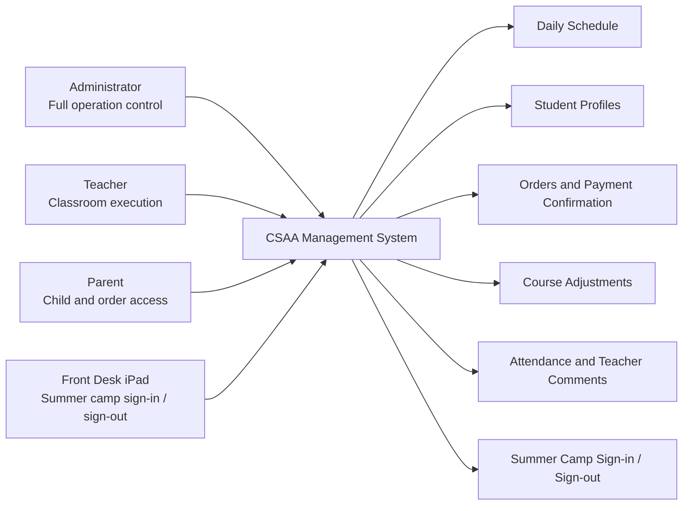
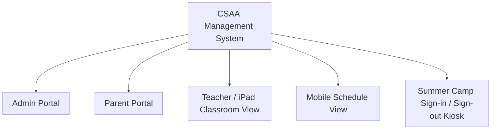
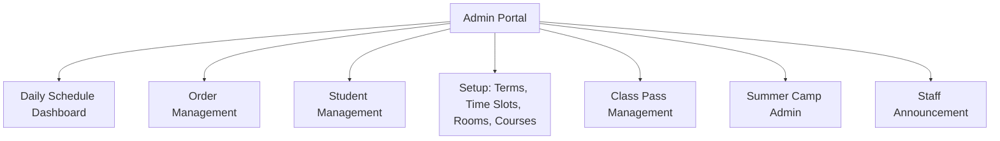
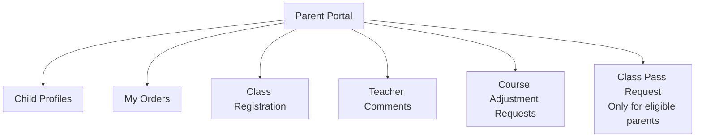
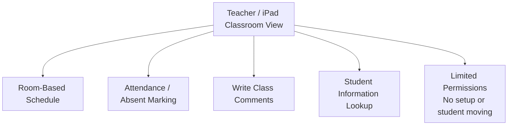
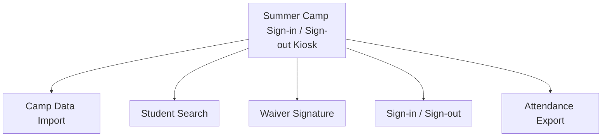
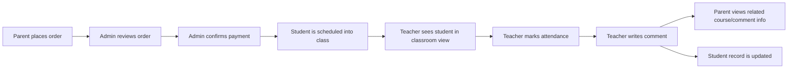
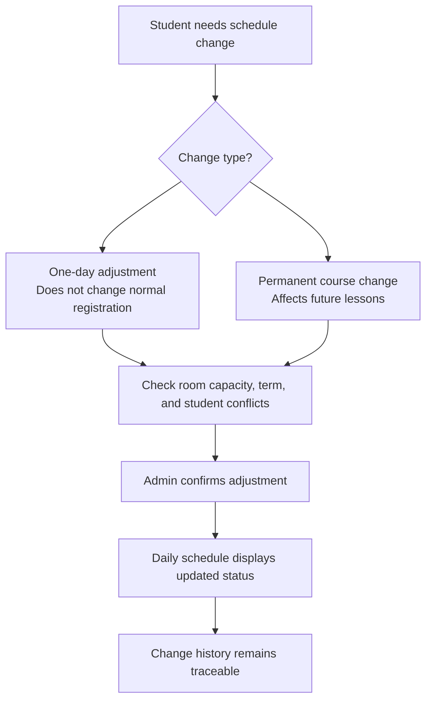
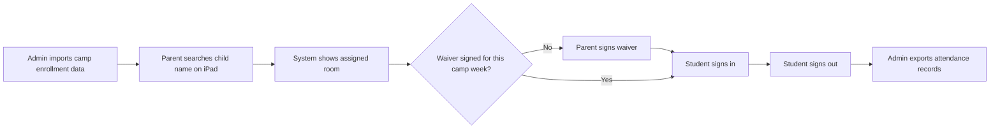

# CSAA Management System - English Project Introduction

## 0. System Structure Diagrams

### Role-Based View

### Main Module Structure

### Admin Portal Modules

### Parent Portal Modules

### Teacher and Classroom Modules

### Summer Camp Sign-in / Sign-out Modules

### Regular Course Operation Flow

### Rescheduling and Manual Adjustment Flow

### Summer Camp Sign-in / Sign-out Flow

## 1. Project Background

This project is a school operation management system for CSAA.

The starting point was not simply course registration. The real business pain points were daily scheduling, rescheduling, classroom capacity control, lesson-hour tracking, teacher comments, attendance visibility, and communication between administrators, teachers, and parents.

Before this system, many of these tasks could be handled through spreadsheets, manual messages, or personal memory. That may work for a small number of students, but it becomes difficult when the school has many rooms, many time slots, multiple children under one parent account, makeup lessons, trial students, class-pass students, and temporary schedule changes.

The goal of this system is to turn daily school operations into a structured workflow:

- Parents submit class requests or orders.
- Administrators confirm payments and arrange classes.
- Teachers see exactly which students should be in each room.
- Attendance and teacher comments are recorded.
- Student records become searchable and traceable.

In short, this is not only a registration website. It is becoming a practical operation system centered on scheduling, student records, classroom execution, and communication.

## 2. Main User Roles

### Administrator

The administrator has full access to the system.

Admin users can manage:

- Students
- Parents
- Courses
- Rooms
- Time slots
- Terms
- Orders
- Payment confirmation
- Schedule changes
- Class passes
- Teacher assignments
- Staff announcements
- Summer camp sign-in / sign-out data

The administrator is the central operator of the school schedule. They can confirm parent orders, assign students to classes, move students for one day, make permanent course changes, mark attendance, review course adjustment requests, and check student history.

### Teacher

The teacher role is intentionally limited.

Teachers can:

- View classroom schedules
- View student information
- Mark attendance or absence
- Write comments after class
- Check which students still need comments

Teachers should not have access to setup functions, payment management, system configuration, or student-moving tools.

This role design protects the system from accidental operational changes while still giving teachers the information they need in class.

### Parent

Parents can log in to the parent portal to view their own children and related school information.

Parents can:

- View child profiles
- Register for classes
- View orders
- View class status
- View teacher comments
- Submit course adjustment or rescheduling requests
- Use class-pass booking if their account has permission

The system supports multiple children under one parent account, which is important because one family may have several children taking different courses.

### Front Desk / Summer Camp Sign-in / Sign-out

There is also a lightweight sign-in / sign-out interface designed for an iPad at the front desk.

This interface does not require full admin login. A parent can search a child by name, see the assigned classroom, complete sign-in or sign-out, and sign a waiver when needed.

This is designed for summer camp or similar short-term programs where many students arrive in the morning and leave in the afternoon.

## 3. Main Interfaces

### Admin Daily Schedule

The daily schedule is the core operational screen.

It shows one day at a time. Rooms are displayed as columns, and time slots are displayed as rows. Each cell shows the course, teacher, room, capacity, and student list for that room and time.

Students are visually marked by status, such as:

- Regular student
- Makeup student
- Trial student
- Moved student
- Canceled student
- Sick or absent student
- Student needing a teacher comment

This lets the administrator understand the whole day quickly:

- Which rooms are full
- Which students were moved
- Which students are absent
- Which classes need attention
- Where each teacher should go

### Manual Adjustment

The system supports manual schedule adjustment.

An administrator can move a student for a single day or prepare for a more permanent course change.

A one-day move does not rewrite the student's normal course registration. It only affects that specific date.

This is important because real schools often have temporary situations:

- Sick leave
- Room changes
- Teacher changes
- Makeup lessons
- One-time family conflicts
- Temporary class combination

The system keeps these changes visible and traceable.

### Classroom for iPad

The classroom view is designed for teachers using an iPad.

Instead of showing the full admin schedule, it focuses on one classroom at a time. Teachers can switch or swipe between rooms and see the students for each time slot.

This interface is cleaner and simpler than the admin dashboard. It is designed for classroom use, not system management.

### Mobile Schedule View

There is also a lightweight mobile schedule view.

It is read-only and optimized for quick checking on a phone. It shows rooms, time slots, student names, status colors, and notes without requiring deep navigation.

This is useful when staff need to quickly check the schedule from a mobile device.

### Order Management

Parents place orders from the parent side.

The order first appears as unpaid or pending. The administrator can then manually confirm payment and arrange the class.

This matches the current business model, where payment is not automatically connected to an external payment provider. The system gives the administrator control over when an order becomes paid and scheduled.

The order notification indicator helps the administrator notice new valid parent orders that need attention.

### Student Management

Each student has a profile that can include:

- Name
- Age
- Gender
- Notes
- Parent information
- Phone number
- Active terms
- Enrolled courses
- Teacher comments
- Course history

This makes the student record the long-term center of the system.

Teacher comments are connected to students, so the school can later review learning progress, attendance patterns, and class performance.

### Course Adjustment / Rescheduling

The system supports student course adjustment requests.

When a student needs to miss a class or take a makeup class, the system can show available options while considering:

- Room capacity
- The student's existing schedule
- The current term
- Possible time conflicts
- Makeup eligibility

The key rule is that a makeup option should not conflict with the child's other courses.

If the student does not have a future term, the options should stay inside the current term.

### Class Pass

The class pass feature is for families who buy flexible lesson credits instead of a fixed weekly course.

Only selected parent accounts can see or use this feature.

Parents can request a time, and the administrator can review and arrange it.

This handles a real business case where some students do not follow a regular weekly schedule.

### Summer Camp Sign-in / Sign-out

The summer camp module is a separate lightweight workflow.

It supports:

- Importing camp student data
- Assigning students to rooms
- Searching students by name
- Signing students in
- Signing students out
- Showing classroom location
- Exporting attendance records
- Collecting a waiver signature

The waiver is intentionally lightweight. The system records whether a parent or guardian accepted the waiver, the signer name, the student, the camp week or term, the waiver version, signing time, and IP address.

## 4. Core Business Logic

The system is built around practical school operation rules.

A student can have different types of attendance or schedule status:

- Normal weekly class
- Trial class
- Makeup lesson
- Class-pass booking
- Temporary moved lesson
- Canceled lesson
- Sick leave
- Absence

A room has a capacity, usually four students for regular classes.

A one-day move only changes the daily schedule for that date. It does not rewrite the student's main course record.

A permanent change should affect future lessons and should be recorded differently from a temporary adjustment.

Canceled or absent students should not appear as normal active students in the same class list. They need to be visible, but clearly marked.

Teacher comments are part of the lesson record. After a class has happened, the system can remind teachers which students still need comments.

Orders are separated from scheduling. A parent can place an order, but the administrator confirms payment and scheduling.

## 5. Data Flow

### Regular Course Workflow

1. Parent submits an order.
2. Admin reviews the order.
3. Admin confirms payment.
4. Admin schedules the student into a course, room, time, and term.
5. Teacher sees the student in the classroom view.
6. Teacher marks attendance and writes comments.
7. Parent can later see relevant course and comment information.
8. Admin can search and analyze the student record.

### Rescheduling Workflow

1. A student needs to miss or change a class.
2. The system records the original course and date.
3. Admin or parent initiates a course adjustment request.
4. The system checks available options.
5. Options must avoid conflicts with the child's current courses.
6. Admin confirms the final makeup or adjustment.
7. The student appears with the correct status on the schedule.

### Summer Camp Workflow

1. Admin imports camp student data.
2. The system creates or matches parent, student, camp week, room, and enrollment.
3. Parent arrives at the front desk.
4. Parent searches the child name on the iPad.
5. System shows the classroom and sign-in button.
6. If the waiver is not signed, parent signs the waiver first.
7. System records sign-in.
8. Parent signs the child out later.
9. Admin can export attendance records.

## 6. Why This System Is Valuable

The system reduces dependence on spreadsheets and manual memory.

It gives the school one operational source of truth.

Administrators can see the whole day.

Teachers can see only what they need.

Parents can check their own children's information.

Student records become searchable.

Schedule changes become traceable.

Attendance and comments become structured data.

The system can later support AI analysis because the operational data is already organized.

## 7. Future AI Direction

This system can become an AI-assisted education operation platform.

AI does not replace the school workflow. It uses the data created by the workflow.

Possible AI features include:

- Attendance-risk analysis
- Automatic summaries of teacher comments
- Student learning profiles
- Makeup lesson recommendations
- Identifying students who may need extra support
- Finding learning gaps from attendance, course progress, and teacher feedback

The important idea is:

Without structured data, AI has no context. This system creates the context first. Then AI can help analyze, summarize, predict, and recommend actions.

## 8. Current Status

The current version already includes the major operational foundation:

- Admin daily scheduling
- Parent orders
- Manual payment confirmation
- Student profiles
- Teacher classroom view
- Mobile schedule view
- Rescheduling logic
- Makeup lesson tracking
- Attendance marking
- Teacher comments
- Class pass
- Summer camp sign-in / sign-out
- Camp data import and export
- Lightweight waiver signing

The system has grown from a course registration project into a broader school operation management platform.

It now supports the daily work of administrators, teachers, parents, and front-desk staff.

The next stage can focus on polishing workflows, improving data import, preparing user manuals, and gradually adding AI-assisted analysis.
